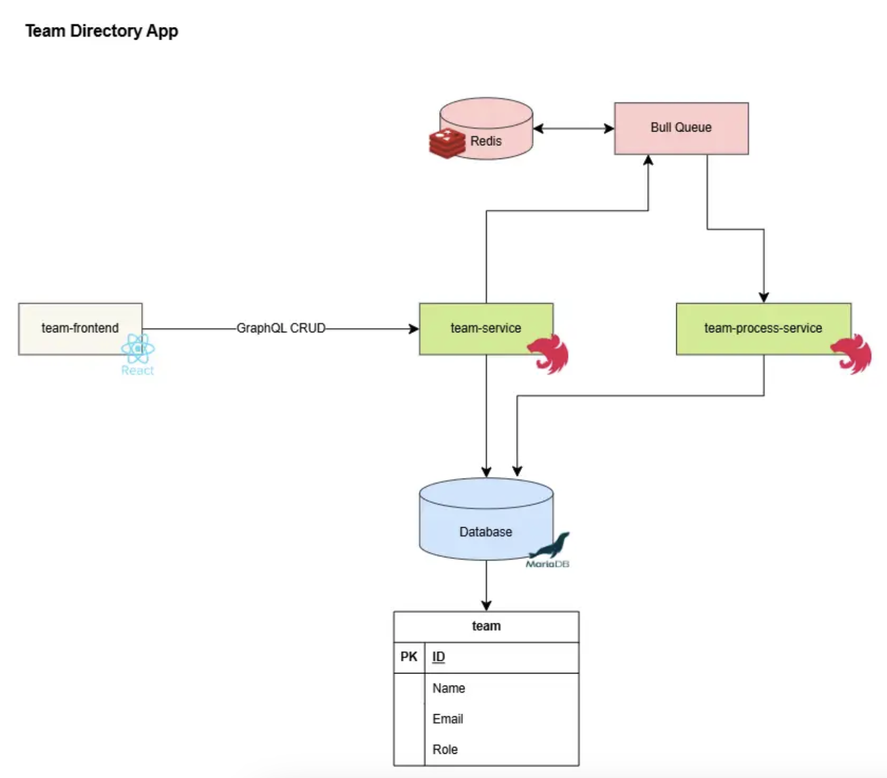

# Team Directory App

## Project Overview

The Team Directory App is a full-stack application designed to manage team members. It provides CRUD (Create, Read, Update, Delete) functionality, including bulk team member addition via CSV file upload.

## Features

*   **Team Member Management:**
    *   List all team members in a sortable table.
    *   Add new team members with name, email, role, and employment type.
    *   Edit existing team member details.
    *   Delete team members with confirmation.
*   **Bulk Upload:**
    *   Upload CSV files to add multiple team members simultaneously.
    *   Automatic mapping of CSV columns (name, email, role, employmentType) to the database schema.
    *   Background processing of bulk imports using a job queue for efficiency.

## Architecture

The application follows a microservices-oriented architecture:


## Tech Stack

### Frontend
- **React (Vite)** – SPA framework
- **Tailwind CSS + shadcn/ui** – Styling and component library
- **Apollo Client** – GraphQL client for state and data fetching
- **PapaParse** – CSV parsing for bulk upload

### Backend
- **NestJS** – Backend framework
- **GraphQL (Apollo Driver)** – API layer
- **TypeORM + MariaDB** – ORM and relational database
- **Bull (with Redis)** – Background job processing (for CSV uploads)

## Prerequisites

Make sure you have:
- [Node.js](https://nodejs.org/en/) (v20+ recommended; use `nvm` for version management)
- [npm](https://www.npmjs.com/) (comes with Node.js)
- [Docker Desktop](https://www.docker.com/products/docker-desktop) (for MariaDB and Redis containers)

## Quick Start

1. **Clone the repository:**
   ```bash
   git clone git@github.com:vinuja-j/team-directory.git
   cd team-directory
   ```

2. **Start MariaDB and Redis (Dockerized):**
   ```bash
   docker run --name team-directory-db      -e MYSQL_ROOT_PASSWORD=teamdata      -e MYSQL_DATABASE=teamdirectory      -p 3306:3306      -d mariadb:latest

   docker run --name team-directory-redis      -p 6379:6379      -d redis:latest
   ```

3. **Start Backend (NestJS):**
   ```bash
   cd team-service
   npm install
   npm run start:dev
   ```
   Backend will run at `http://localhost:3000/graphql`.

4. **Start Frontend (React):**
   ```bash
   cd frontend
   npm install
   npm run dev
   ```
   Frontend will run at `http://localhost:5173`.

5. **Access the App:**
   Visit [http://localhost:5173](http://localhost:5173) in your browser.

## CSV Import Format

When uploading a CSV file for bulk team member creation, ensure it follows this exact header and order:

```csv
name,email,role,employmentType
```

**Example `sample-team-members.csv`:**
```csv
Janu Perera,janu@example.com,UI/UX Designer,PartTime
Mark Johnson,mark@example.com,QA Engineer,FullTime
Dinil Jayamanna,dinil@example.com,Product Manager,FullTime
```
*   **Important:** The `employmentType` column must contain one of these exact values: `"FullTime"`, `"PartTime"`, or `"Intern"`.
